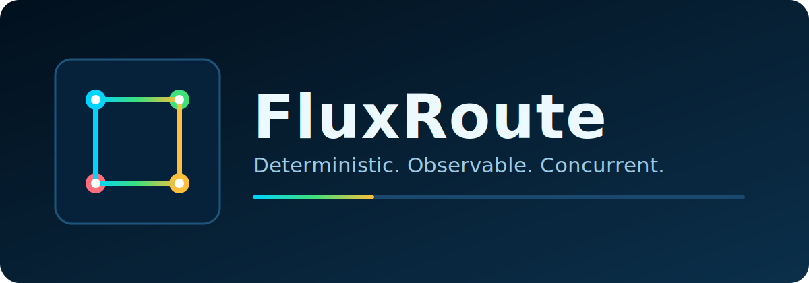
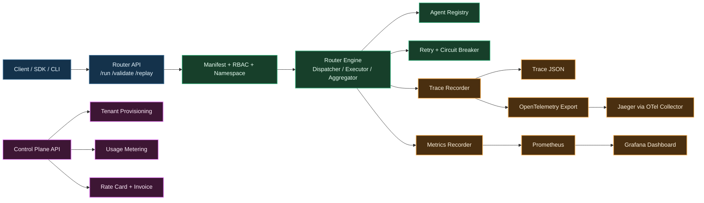
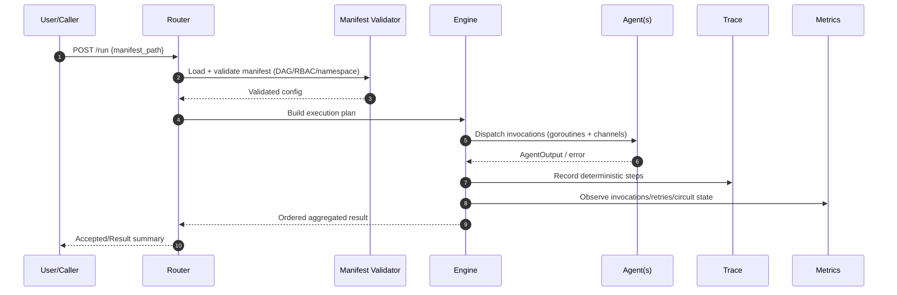
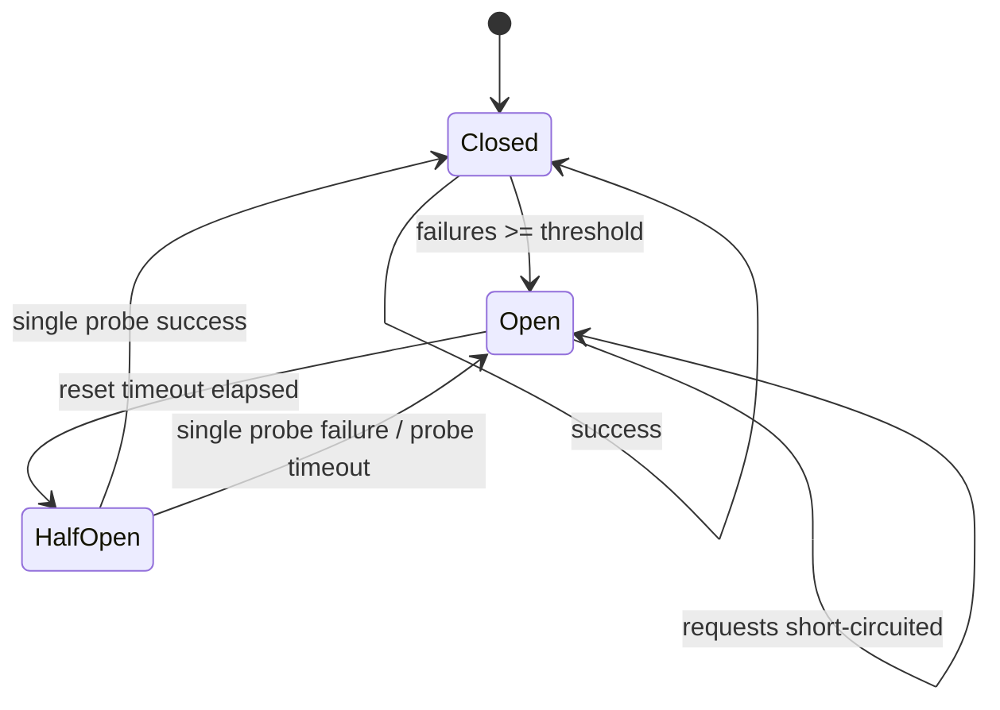
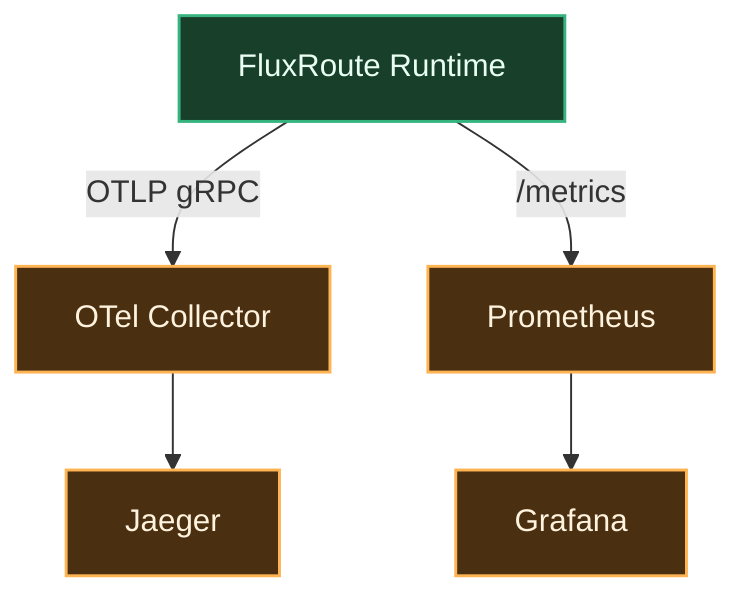

<div align="center">
  

  <p>
    <a href="https://github.com/yagna-1/fluxroute/actions/workflows/ci.yml"></a>
    
    
    
    
  </p>

  <p><strong>FluxRoute</strong> is a deterministic, channel-based AI orchestration runtime in Go.</p>
</div>

## Why FluxRoute

- Deterministic DAG execution with replay validation.
- Explicit state, strict manifest validation, and no hidden framework magic.
- Built-in resilience: retry filtering, circuit breaker with half-open probe timeout, and panic containment.
- Production-friendly observability: JSON logs, OpenTelemetry, Prometheus, audit export.
- Enterprise primitives: RBAC, namespace isolation, coordination leases, control-plane APIs.

## Animated identity

<div align="center">
  
</div>

## Architecture



## Execution flow



## Resilience model



## Quick start

```bash
cd <repo-root>
~/.local/go1.26.0/bin/go mod tidy
make test
make lint
make build
make build-cli
make build-controlplane
make run
```

## Core commands

| Goal | Command |
|---|---|
| Run default manifest | `make run` |
| Run custom manifest | `make run MANIFEST_PATH=path/to/manifest.yaml` |
| Start Router API server | `make serve` |
| Validate manifest | `make validate MANIFEST_PATH=path/to/manifest.yaml` |
| Replay deterministic trace | `make replay MANIFEST_PATH=trace.json` |
| Scaffold starter pipeline | `make scaffold TARGET_DIR=./generated PIPELINE_NAME=myflow` |
| Compare expected vs actual traces | `make debug EXPECTED_TRACE=a.json ACTUAL_TRACE=b.json` |
| Start control plane | `make run-controlplane` |
| Benchmark router paths | `make bench` |
| Observability stack up/down | `make trace-view` / `make trace-down` |
| Validate/apply k8s manifests | `make k8s-validate` / `make k8s-apply` |
| Delete k8s manifests | `make k8s-delete` |

## API surface

### Router (`cmd/router serve`)

| Method | Path | Purpose |
|---|---|---|
| `GET` | `/healthz` | Liveness |
| `GET` | `/readyz` | Readiness |
| `POST` | `/run` | Run manifest (`{"manifest_path":"..."}`) |
| `POST` | `/validate` | Validate manifest (`{"manifest_path":"..."}`) |
| `POST` | `/replay` | Replay trace (`{"trace_path":"..."}`) |

### Control plane (`cmd/controlplane`)

| Method | Path | Purpose |
|---|---|---|
| `GET` | `/healthz` | Liveness |
| `GET` | `/readyz` | Readiness |
| `GET` | `/sla` | SLA telemetry snapshot |
| `POST` | `/tenants` | Create tenant (admin) |
| `GET` | `/tenants` | List tenants |
| `POST` | `/usage` | Add usage (admin) |
| `GET` | `/usage?tenant_id=...` | Read tenant usage |
| `GET` | `/billing/rates` | Get pricing |
| `POST` | `/billing/rates` | Update pricing (admin) |
| `GET` | `/billing/invoice?tenant_id=...` | Generate invoice view |

## Observability stack



- Local stack definition: `deploy/observability/docker-compose.yml`
- Dashboard JSON: `deploy/observability/grafana/dashboards/fluxroute-overview.json`

## Configuration highlights

- Tracing: `TRACE_ENABLED`, `TRACE_ENDPOINT`, `TRACE_OUTPUT`
- Metrics: `METRICS_ENABLED`, `METRICS_ADDR`, `METRICS_TLS_*`
- Security: `REQUEST_ROLE`, `AUDIT_LOG_PATH`
- Coordination: `COORDINATION_ENABLED`, `COORDINATION_MODE`, `COORDINATION_REDIS_URL`
- Resilience:
  - `CIRCUIT_FAILURE_THRESHOLD`, `CIRCUIT_RESET_TIMEOUT`, `CIRCUIT_PROBE_TIMEOUT`
  - `retry.retryable_errs` behavior via `RetryPolicy.RetryableErrs` in runtime API
- Router TLS: `ROUTER_TLS_ENABLED`, `ROUTER_TLS_*`
- Control-plane TLS: `CONTROLPLANE_TLS_ENABLED`, `CONTROLPLANE_TLS_*`

## Deployment assets

- Docker: `deploy/Dockerfile.router`, `deploy/Dockerfile.controlplane`
- Kubernetes: `deploy/k8s/kustomization.yaml`
- CI workflow: `.github/workflows/ci.yml`

## Version commands

```bash
go run ./cmd/router --version
go run ./cmd/cli version
go run ./cmd/controlplane version
```

## Documentation map

- `docs/end-user-goals.md`
- `docs/development-blueprint.md`
- `docs/goal-to-dev-traceability.md`
- `docs/operations.md`
- `docs/release-checklist.md`
- `docs/requirement-verification-2026-02-14.md`
